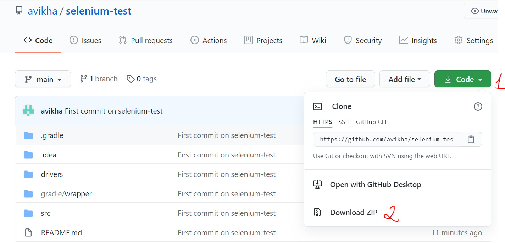
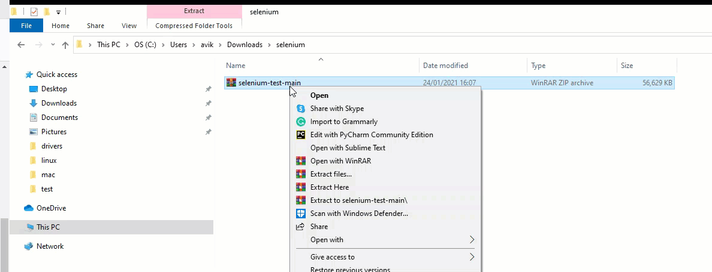
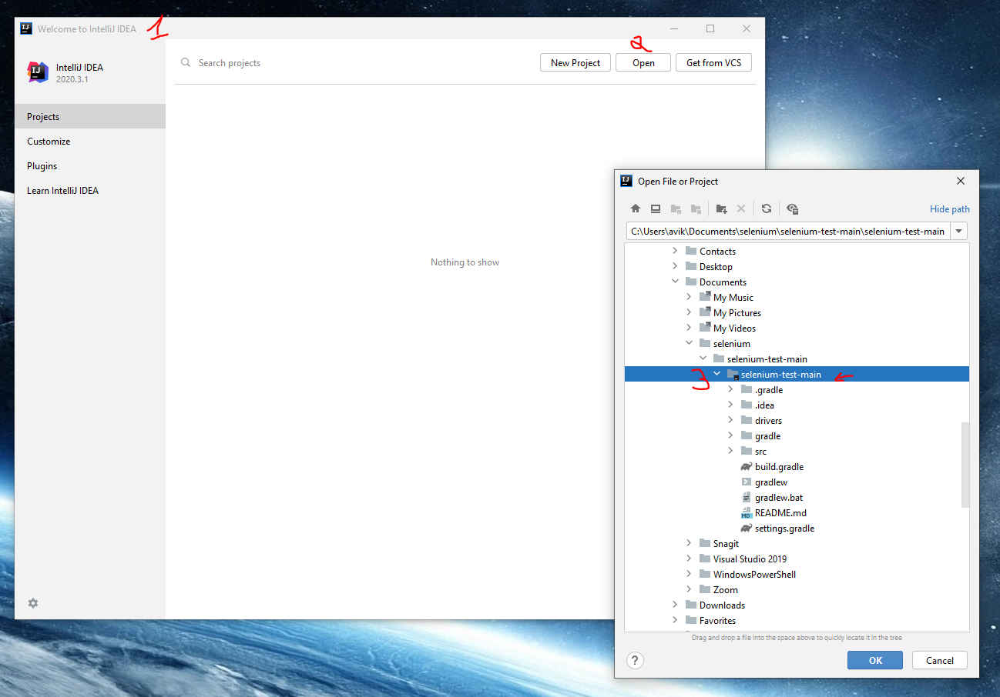
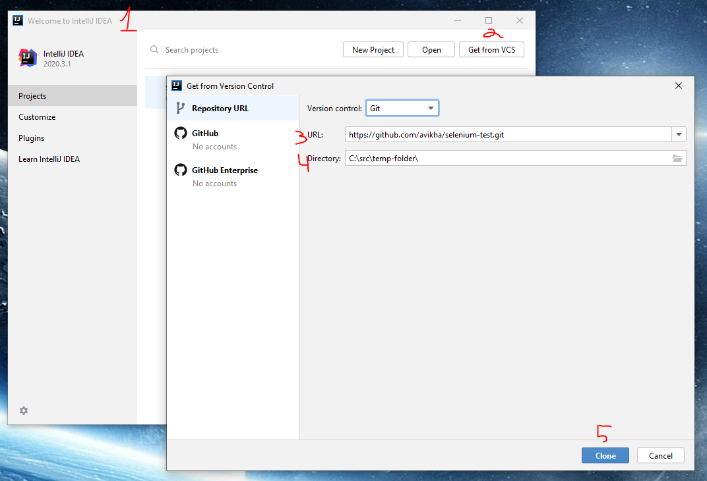
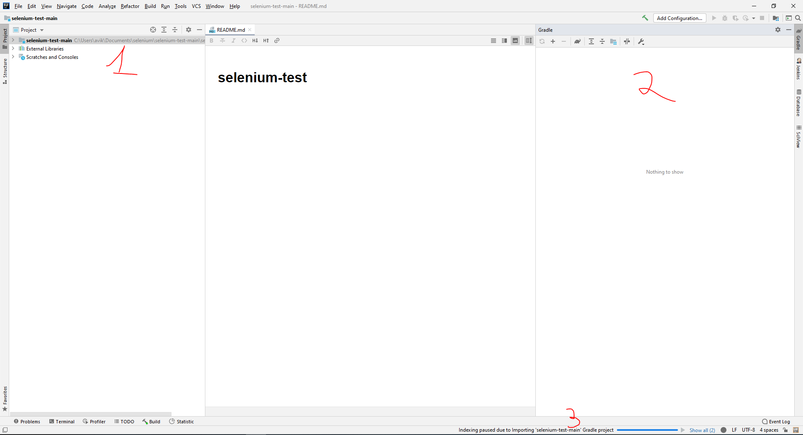
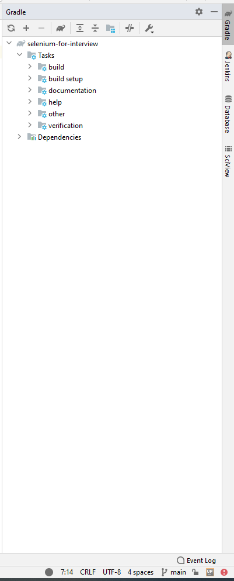
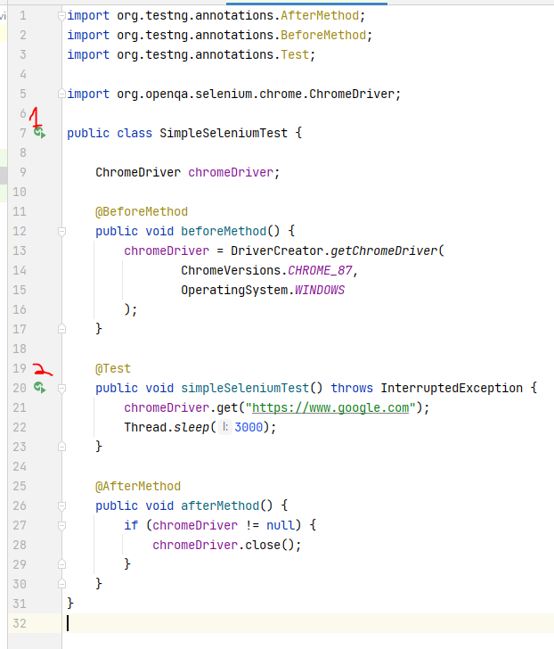
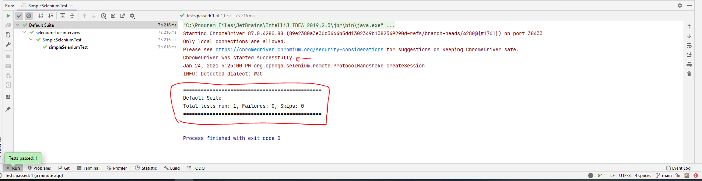

# The Environment For Selenium Test

This is a quick tutorial to install selenium/intellij and all the dependencies prior of the attending the test.

### Step 1 - IDE and basic environment 
Download and install the community version IntelliJ. Here is the link for more information - https://www.jetbrains.com/idea/download/#section=windows

### Step 2 - Get the project

Either download or clone it from its repository. Then, extract it and open it with the intellij. 

#### Option 1: Download

Navigate to https://github.com/avikha/selenium-test, click on the green button `code` and then click on `download zip` option. 



Extract the zip file using the WinRAR application 



Import the project into IntelliJ library - 



1. Open IntelliJ.
2. Choose `Open Project`
3. Choose the `selenium-test-main` folder, the actual folder you extracted the project. 

#### Option 2: Use IntelliJ and get from VCS



1. Open IntelliJ.
2. Click 'Get from VSC'
3. Paste repository link https://github.com/avikha/selenium-test. 
4. Enter the directory where you want it. 
5. Click `clone` and let IntelliJ do its work.

### Step 3 - Configure, build, run

#### Configure / Build

After you've downloaded the project (either getting it from VCS or downloading and extracting), and after you open the project inside the IntelliJ IDE then this is what you should see -   



1. Project structure.
2. Gradle project options. 
3. The current intellij process which is running. 

Opening the folder/project with IntelliJ will immediately trigger Gradle project configuration. It will try to download the gradle project. In our case it will try to download the selenium and testng libraries. We need them both to run this specific project. 

After the download is done, the part [2] of your screen should look like that



This is a good indication that everything went by plan - IntelliJ imported and recognized our project and that we are ready to go. 

#### Run it. 

Open the `Java` file you should use in this test. `src/test/java/SimpleSeleniumTest.java`.

First, let us configure your env - 

```java
@BeforeMethod
public void beforeMethod() {
    chromeDriver = DriverCreator.getChromeDriver(
            ChromeVersions.CHROME_87,
            OperatingSystem.WINDOWS
    );
} 
```

1. Instead of `ChromeVersions.CHROME_87` you should use your chrome version. We recommend you update your chrome version to latest stable version and then select it inside the `enum`. To upate your chrome version please use [this](https://support.google.com/chrome/answer/95414) article. 
2. Instead of `OperatingSystem.WINDOWS` please choose your operating system. 

Now, you should see the little `play` button (if you don't see it, then you had problems with gradle and testng) 



His either [1] or [2] and it should build and run. How do you know it runs and everything is OK? Well, there is two indications: First, you should see your chrome browser starting, navigating to `www.google.com` page and then closing itself. Second, you should see the following message on your IntelliJ - 



### More installations options -

For more installations options you can check the following tutorials - 
1. [Guru99 - Install SE + IntelliJ](https://www.guru99.com/intellij-selenium-webdriver.html)
2. [Install SE with Eclipse](https://www.guru99.com/installing-selenium-webdriver.html)
3. [Official SE Tutorial](https://www.selenium.dev/documentation/en/selenium_installation/installing_selenium_libraries/)
4. [From Edureka Tutorials](https://www.edureka.co/blog/selenium-installation/)